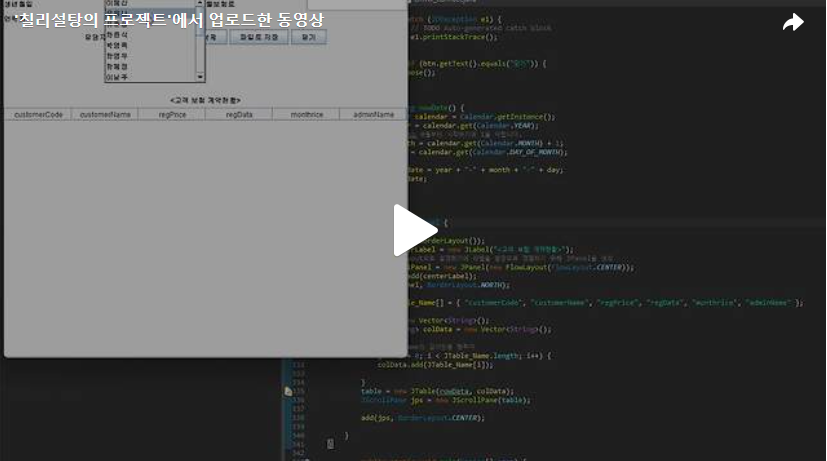

오늘은 Day10에 만들었던 Gui에 ActionListener 를 달아주는 코드를 작성해보겠습니다.<br>
아래 화면이 Day10에서 만든 화면입니다.<br>


<br>
오늘 저희가 ActionListener를 달아야 하는 조건을 살펴보도록 하겠습니다.<br>
<br>
1. “고객명”의 콤보박스에서 선택하면 해당 고객코드, 생년월일, 연락처가 표시되도록 하시오. 선택 전에는 디폴트로 첫 번째 고객명이 선택되도록 하시오.<br>
2. 보험계약 창에는 해당 고객이 가입한 “고객 보험 계약현황”이 표시되도록 하고, 최근 가입일(regDate) 순서로 나타나도록 하시오.<br>
3. 보험계약 창에서 고객명, 보험상품, 가입금액, 월보험료, 담당자를 선택 및 입력한 후 [가입] 버튼을 클릭하면 DB에 저장되도록 하시오. 단 가입일(regDate)은 오늘날짜가 자동으로 저장되도록 하고, 저장된 후 “고객 보험 계약현황”이 수정 표시되도록 하시오.<br>
4. 보험계약 창에서 계약현황 중에서 하나를 선택 후, [삭제] 버튼을 클릭하면 [그림 2-21]와 같이 삭제 확인메시지를 출력하시오.<br>
5. 삭제 확인메시지에서 [확인] 버튼을 클릭하였을 때 삭제되도록 하고, 삭제된 후 “고객 보험 계약현황”이 수정 표시되도록 하시오. 만약 [취소]를 누르면 삭제되지 않도록 하시오.<br>
6. 보험계약 창에서 [파일로저장] 버튼을 클릭하였을 때 [그림 2-22]과 같이 파일 다이얼로그 창이 열리도록 하시오.<br>
7. [그림 2-22]에서 파일을 저장할 경로와 파일이름을 입력한 후 [저장] 버튼을 클릭하면 [그림 2-23]과 같이 고객정보가 텍스트파일로 저장되도록 하시오.<br>
<br>


위의 조건을 하나하나 살펴보며 시작하겠습니다!<br>
1번조건과 2번조건을 묶어서 살펴보도록 하겠습니다.<br>
<br>
“고객명”의 콤보박스에서 선택된 고객의 이름을 가져와 Mysql에 "select * from customer where name like + 선택된 고객이름" 구문을 이용해 선택된 고객의 정보를 모두 가져와 Vector에 저장을 합니다. 벡터에는 "고객코드", "고객명", "생년월일", "연락처", "주소", "회사" 순서대로 저장이 됩니다. 1번조건을 봤을때 필요한 부분은 "고객코드",  "생년월일", "연락처" 이기에 Vector에서 정보를 가져와 Gui의 JTextField에 정보를 삽입하면 됩니다. <br>
<br>
또한 2번조건의 JTable에도 추가를 해야 하기에  Mysql에 select * from contract where customerCode = 선택된 고객의 고객코드 + order by regData 구문을 이용합니다. contract테이블은 지금까지 보험계약이 완료된 정보가 들어있는 테이블이며 order by regData는 Mysql 구문을 통해 나온 정보를 regData필드 순으로 오름차순 한다는 의미입니다. 구문을 통해 나온 정보를 Vetor에 저장을 하고 JTable에 추가를 하겠습니다.<br><br>


<br>
3번조건을 살펴보도록 하겠습니다.<br>
3번조건은 보험계약 창에서 "고객명", "보험상품" ,"가입금액" ,"월보험료" ,"담당자"를 선택 및 입력한 후 [가입] 버튼을 클릭하면 DB에 저장되도록 하도록 해야합니다.<br><br>
contract테이블에는 "고객코드", " 보험상품 ", "가입금액", "가입일", "월보험료", "담당자" 이렇게 6개의 필드가 존재하기에 Mysql의 구문에 insert into contract values (?, ?, ?, ?, ?, ?)  이렇게 구문을 만들고 ?안에 필드 순으로 변수를 넣어줘야 합니다. 이렇게 insert구문을 이용해 데이터베이스에 가입한정보를 삽입합니다.<br>


<br>코드를 보다보면 s[3] = nowDate()라는 코드가 보일겁니다. 이 코드는 Calendar클래스를 이용하여 현재시간을 받아오는 함수입니다. <br>


<br>
4번조건과 5번조건을 같이 살펴보도록 하겠습니다.<br>
<br>
JTable에서 선택된 행에 대해 삭제를 해야하기에 int selection = table.getSelectedRow() 이구문을 이용하여 선택된 행에 대한 index값을 가져옵니다. Vector<String> vc = (Vector<String>) rowData.get(selection)를 이용하여 선택된 행에 대한 정보를 Vector에 저장을 합니다. remove(selection)을 이용하여 선택된 행을 JTable에서 삭제합니다. 데이터베이스에서도 정보를 삭제 해야하기에 Mysql에 "delete from customer where code = 선택된 행의 고객에 대한 코드번호 "구문을 이용하여 데이터베이스에서도 삭제를 합니다.<br>


<br>
6번조건과 7번조건을 같이 살펴보도록 하겠습니다.<br>
"파일로 저징" 버튼을 눌렀을때 [그림 2-22]와 같이 파일 다이얼로그 창을 만들어주기 위해 프레임을 하나 만들고 FileDialog를 통해 [그림 2-22]와 같은 파일 다이얼로그 창을 생성해줍니다. 또한  파일 다이얼로그 창이 생성되면 사용자가 선택한 디렉토리와  사용자가 입력한 파일 이름을 가져와 경로를 생성해줍니다.<br>
경로에 대한 FileWriter를 생성하여 파일을 열고, 선택한 고객명과 담당자명을 파일에 쓰고, 테이블의 데이터를 파일에 쓰기 위해 반복문을 사용합니다.<br><br>


<br>
<br>

이렇게 하면 조건을 전부 충족하게 코드를 다 짜보았습니다. <br>

실행결과화면 보시죠!<br>
[](https://tv.kakao.com/v/445623695)<br>

<br>아래는 전체코드입니다. <br>
```java
package customer_ui;

import java.awt.BorderLayout;
import java.awt.Container;
import java.awt.FileDialog;
import java.awt.FlowLayout;
import java.awt.GridLayout;
import java.awt.event.ActionEvent;
import java.awt.event.ActionListener;
import java.io.FileWriter;
import java.io.IOException;
import java.sql.Connection;
import java.sql.PreparedStatement;
import java.sql.ResultSet;
import java.sql.SQLException;
import java.sql.Statement;
import java.util.Calendar;
import java.util.Vector;

import javax.swing.JButton;
import javax.swing.JComboBox;
import javax.swing.JFrame;
import javax.swing.JLabel;
import javax.swing.JOptionPane;
import javax.swing.JPanel;
import javax.swing.JScrollPane;
import javax.swing.JTable;
import javax.swing.JTextField;
import javax.swing.table.DefaultTableModel;

import customer_db.Driver_connect;
import customer_ui.Customer_Inquiry.Top;

public class Contract_Management extends JFrame {
	JComboBox cb1;
	JTextField jt;
	JTextField JtMenu[];
	Vector rowData;
	Vector<String> data = new Vector<String>();
	JTable table;
	JComboBox cb;
	JComboBox cb2;
	String[] s = new String[6];

	public Contract_Management() {
		setTitle("보험 계약");
		setDefaultCloseOperation(JFrame.EXIT_ON_CLOSE);
		Container c = getContentPane();
		c.add(new Top(), BorderLayout.NORTH);
		c.add(new Center(), BorderLayout.CENTER);
		c.add(new Bottom(), BorderLayout.SOUTH);

		setSize(700, 700);
		setVisible(true);

	}

	class Top extends JPanel {

		public Top() {
			setLayout(new GridLayout(4, 2));
			JLabel code = new JLabel("고객코드: ");
			add(code);
			jt = new JTextField(15);
			add(jt);

			String insurance[] = { "무배당암보험", "변액연금보험", "여성건강보험", "연금보험", "의료실비보험", "종신보험" };
			JLabel insuranceProduct = new JLabel("보험상품: ");
			add(insuranceProduct);
			cb = new JComboBox(insurance);
			add(cb);

			JLabel customerName = new JLabel("고객명: ");
			add(customerName);

			String customerSql = "select name from customer";
			try {
				Connection conn = Driver_connect.makeConnection("customer");
				Statement stmt = conn.createStatement();
				ResultSet rs = stmt.executeQuery(customerSql);

				Vector<String> v1 = new Vector<String>();
				while (rs.next()) {
					String name = rs.getString("name");
					v1.add(name);
				}
				// Vector에 저장된 정보를 ComboBox에 삽입
				cb1 = new JComboBox(v1);
				cb1.addActionListener(new Action());
				add(cb1);
				String Menu[] = { "가입금액", "생년월일", "월보험료", "연락처" };
				JtMenu = new JTextField[Menu.length];
				JLabel MenuLa[] = new JLabel[Menu.length];
				for (int i = 0; i < Menu.length; i++) {
					MenuLa[i] = new JLabel(Menu[i]);
					add(MenuLa[i]);
					JtMenu[i] = new JTextField(15);
					add(JtMenu[i]);

				}

			} catch (SQLException e) {
				// TODO Auto-generated catch block
				e.printStackTrace();
			}
		}
	}

	class Action implements ActionListener {
		@Override
		public void actionPerformed(ActionEvent e) {
			String selectedName = cb1.getSelectedItem().toString();
			String sql = "select * from customer where name like '" + selectedName + "'";
			try {
				Connection conn = Driver_connect.makeConnection("customer");
				Statement stmt = conn.createStatement();
				ResultSet rs = stmt.executeQuery(sql);
				data.clear();

				while (rs.next()) {
					for (int k = 0; k < 6; k++) {
						data.add(rs.getString(k + 1));
					}
				}
				jt.setText(data.get(0));
				JtMenu[1].setText(data.get(2));
				JtMenu[3].setText(data.get(3));
				rs.close();

			} catch (SQLException e1) {
				// TODO Auto-generated catch block
				e1.printStackTrace();
			}
			Connection conn = Driver_connect.makeConnection("customer");

			try {
				rowData.clear();
				Statement stmt = conn.createStatement();
				String tableSql = "select * from contract where customerCode= '" + data.get(0) + "'order by regData";
				ResultSet rs1 = stmt.executeQuery(tableSql);

				while (rs1.next()) {
					Vector<String> v = new Vector<String>();
					for (int t = 0; t < 6; t++) {
						v.add(rs1.getString(t + 1));
					}
					rowData.add(v);
				}
				rs1.close();
				table.updateUI();
				conn.close();
			} catch (SQLException e1) {
				// TODO Auto-generated catch block
				e1.printStackTrace();
			}

		}
	}

	class Center extends JPanel {
		public Center() {
			JLabel la3 = new JLabel("담당자: ");
			add(la3);

			String adminSql = "select name from admin";
			// mysql admin에 있는 관리자 명단 Vector에 저장
			try {

				Connection conn = Driver_connect.makeConnection("customer");
				Statement stmt = conn.createStatement();
				ResultSet rs = stmt.executeQuery(adminSql);

				Vector<String> v2 = new Vector<String>();
				while (rs.next()) {
					String name = rs.getString("name");
					v2.add(name);
				}
				// Vector에 저장된 정보를 ComboBox에 삽입
				cb2 = new JComboBox(v2);
				add(cb2);

			} catch (SQLException e) {
				// TODO Auto-generated catch block
				e.printStackTrace();
			}
			// 가입,삭제,파일로 저장, 닫기 버튼 생성
			String ButtonMenu[] = { "가입", "삭제", "파일로 저장", "닫기" };
			JButton btn[] = new JButton[ButtonMenu.length];
			for (int t = 0; t < ButtonMenu.length; t++) {
				btn[t] = new JButton(ButtonMenu[t]);
				add(btn[t]);
				//가입, 삭제, 파일로 저장, 닫기 버튼을 눌렀을때 생기는 ActionListener 
				btn[t].addActionListener(new Action1());
			}

		}

		class Action1 implements ActionListener {
			@Override
			public void actionPerformed(ActionEvent e) {
				JButton btn = (JButton) e.getSource();
				if (btn.getText().equals("가입")) {
					Connection con = Driver_connect.makeConnection("customer");
					String sawoninsert = "insert into contract values (?, ?, ?, ?, ?, ?) ";
					PreparedStatement psmt = null;

					try {
						psmt = con.prepareStatement(sawoninsert);
						s[0] = data.get(0);
						s[1] = cb.getSelectedItem().toString();
						s[2] = JtMenu[0].getText();
						s[3] = nowDate();
						s[4] = JtMenu[2].getText();
						s[5] = cb2.getSelectedItem().toString();

						for (int i = 0; i < s.length; i++) {
							psmt.setString(i + 1, s[i]);
						}
						JOptionPane.showMessageDialog(null, "보험을 가입했습니다.");
						psmt.executeUpdate();
						//데이터를 추가할 수 있도록 DefaultTableModel을 사용
						DefaultTableModel model = (DefaultTableModel) table.getModel();
						model.addRow(s);

					} catch (SQLException e1) {
						// TODO Auto-generated catch block
						e1.printStackTrace();
					}

				} else if (btn.getText().equals("삭제")) {
					int selection = table.getSelectedRow();
					Vector<String> vc = (Vector<String>) rowData.get(selection);

					int num = JOptionPane.showConfirmDialog(null, vc.get(0) + "(" + vc.get(1) + ")" + "을 삭제하시겠습니까?",
							"계약정보 삭제", JOptionPane.CANCEL_OPTION);

					if (num == 0) {
						// 행이 선택되지 않았을 경우
						if (selection == -1) {
							JOptionPane.showConfirmDialog(null, "행이 선택되지 않았습니다");
							return;
						} else {
							//데이터를 삭제할 수 있도록 DefaultTableModel을 사용
							DefaultTableModel m = (DefaultTableModel) table.getModel();
							m.removeRow(selection);
							String sql = "delete from customer where code = '" + vc.get(0) + "'";
							try {
								Connection conn = Driver_connect.makeConnection("customer");
								PreparedStatement psmt = conn.prepareStatement(sql);
								psmt.executeUpdate();
								jt.updateUI();

							} catch (SQLException e1) {
								// TODO Auto-generated catch block
								e1.printStackTrace();
							}
						}
						// 취소를 누를경우 JOptionPane 종료
					} else if (num == 1) {
					}

				} else if (btn.getText().equals("파일로 저장")) {
					JFrame f = new JFrame();
					f.setSize(350, 250);
					f.setLayout(null);
					f.setVisible(false);

					FileDialog dialog = new FileDialog(f, "텍스트 파일로 저장하기", FileDialog.SAVE);
					dialog.setVisible(true);

					String path = dialog.getDirectory() + dialog.getFile();
					
					try {

						FileWriter w = new FileWriter(path);
						w.write("고객명: " + cb.getSelectedItem().toString() + "(" + data.get(0) + ")\r\n");
						w.write("담당자명: " + cb2.getSelectedItem().toString() + "\r\n\n\n");
						w.write("보험상품  \t가입금액  \t가입일  \t \t월보험료  \r\n\n");

						for (int i = 0; i < table.getRowCount(); i++) {
							
							Vector<String> v = (Vector<String>) rowData.get(i);
							Vector<String> v1 = new Vector<String>();
							for (int t = 1; t <= 4; t++) {
								v1.add(v.get(t));
								w.write(v1.get(t - 1) + " \t");
							}
							w.write("\r\n");
						}

						w.close();

					} catch (IOException e1) {
						// TODO Auto-generated catch block
						e1.printStackTrace();
					}

				} else if (btn.getText().equals("닫기")) {
					dispose();
				}
			}
			
			public String nowDate() {
				Calendar calendar = Calendar.getInstance();
				int year = calendar.get(Calendar.YEAR);
				// month는 0월부터 시작하기에 1을 더합니다.
				int month = calendar.get(Calendar.MONTH) + 1;
				int day = calendar.get(Calendar.DAY_OF_MONTH);

				String date = year + "-" + month + "-" + day;
				return date;
			}
		}
	}

	class Bottom extends JPanel {
		public Bottom() {
			setLayout(new BorderLayout());
			JLabel centerLabel = new JLabel("<고객 보험 계약현황>");
			// BorderLayout으로 설정했기에 라벨을 중앙으로 정렬하기 위해 JPanel을 생성
			JPanel labelPanel = new JPanel(new FlowLayout(FlowLayout.CENTER));
			labelPanel.add(centerLabel);
			add(labelPanel, BorderLayout.NORTH);

			String JTable_Name[] = { "customerCode", "customerName", "regPrice", "regData", "monthrice", "adminName" };

			rowData = new Vector<String>();
			Vector<String> colData = new Vector<String>();

			// JTable_Name의 길이만큼 행추가
			for (int i = 0; i < JTable_Name.length; i++) {
				colData.add(JTable_Name[i]);

			}
			table = new JTable(rowData, colData);
			JScrollPane jps = new JScrollPane(table);

			add(jps, BorderLayout.CENTER);

		}
	}

			public static void main(String[] args) {
			new Contract_Management();
	
	   }   
}

