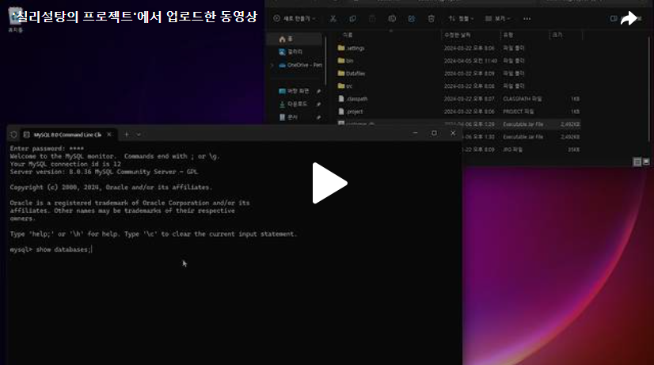
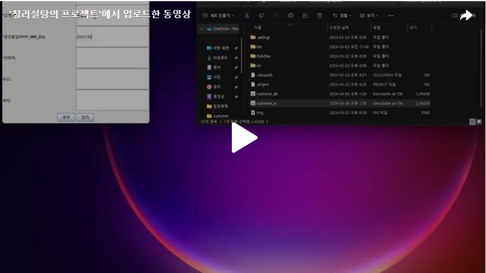

Day1부터 Day11까지 코드를 전부 완성하여 코드는 전부 다 짰습니다. 이제 코드를 jar로 만들는 마지막 작업을 해보도록 하겠습니다! 

jar파일을 만드는 방법에 대해서는 아래에 포스팅 하겠습니다. 

[블로그 바로가기](https://chillysugar-study.tistory.com/5)

 
이제 프로젝트에 대한 ui, 데이터에 대한 jar파일을 만들고 하나하나 동작이 제대로 돌아가는지 확인 해보겠습니다! 
 
 
1)데이터 파일 
 

 
 

2)UI 
 

 
 

지금까지 만든 코드를 jar파일로 만들고 제대로 작동이 되는것을 확인했습니다! 
 
이렇게 첫번째 프로젝트 문제를 해결하였습니다. 저에게 있어서 처음 시도였기에 코드도 부족한 부분도 많았을것 같고 매끄럽지 않은 부분도 많았을거 같아서 아쉬운 부분도 있습니다. 하지만 제가 시작을 하고 끝을 맺었다는 것에 정말 뿌듯합니다!!  
다음 두번째 프로젝트에서는 조금도 완성된 코드를 보여드리기 위해 노력하겠습니다.  
Day1부터 Day12까지 읽어주셔서 정말 감사합니다 

 
