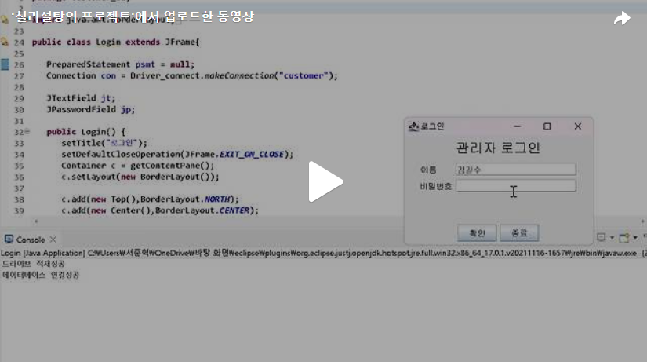

Day4에서 만들었던 Gui의 틀에 이어서 Jbutton들에 ActionListener를 걸고 MySQL과 연동하여 MySQL의 admin테이블에 존재하는 정보들로 로그인이 되도록 해보겠습니다.<br>
우선 앞에서 했듯이 MySQL의 customer 데이터베이스에 접속하겠습니다.<br>


이렇게 추가하고 실행을 해준다면 아래와 같이 Eclipse와 Mysql의 customer데이터베이스에 연결이 됬다는걸 확인 할 수 있습니다.!!<br>


이제 Bottom 클래스에 존재하는 Jbutton들에 대하여 ActionListener를 걸어주도록 하겠습니다.<br>
이렇게 각 버튼들에 대하여 addActionListener(추가할 클래스명)을 해주면 추가할 클래스 안에 존재하는 코드들이 버튼을 누를때마다 실행이 됩니다.<br>
하지만 지금 빨간줄이 뜨는 이유는 아직 추가할 클래스를 정의해 주지 않았기 때문입니다!<br>

<br>

이제 Action이라는 클래스를 정의해 주도록 하겠습니다.<br>
Action클래스는 Jbutton인 "확인","종료" 버튼을 눌렀을때 Mysql의 "admin" 관리자테이블로 접속해 name과 passwd의 정보와 자신이 입력한 이름과 비밀번호를 비교해 존재하면 로그인이 되는 클래스입니다. 또한 로그인을 성공했을때 Joptionpane, 실패했을때 Joptionpane을 만들어줍니다. <br>


실행했을때 Mysql의 admin 테이블에 존재하는 이름과 일치하는 비밀번호이면 로그인이 되는것을 볼수 있습니다.<br>
[](https://tv.kakao.com/v/444763878)<br>

```java
package customer_ui;

import java.awt.BorderLayout;
import java.awt.Container;
import java.awt.Font;
import java.awt.event.ActionEvent;
import java.awt.event.ActionListener;
import java.sql.Connection;
import java.sql.PreparedStatement;
import java.sql.ResultSet;
import java.sql.SQLException;
import java.sql.Statement;

import javax.swing.JButton;
import javax.swing.JFrame;
import javax.swing.JLabel;
import javax.swing.JOptionPane;
import javax.swing.JPanel;
import javax.swing.JPasswordField;
import javax.swing.JTextField;

import customer_db.Driver_connect;

public class Login extends JFrame{
   
   PreparedStatement psmt = null;
   Connection con = Driver_connect.makeConnection("customer");
   
   JTextField jt;
   JPasswordField jp;
   
   public Login() {
      setTitle("로그인");
      setDefaultCloseOperation(JFrame.EXIT_ON_CLOSE);
      Container c = getContentPane();
      c.setLayout(new BorderLayout());
      
      c.add(new Top(),BorderLayout.NORTH);
      c.add(new Center(),BorderLayout.CENTER);
      c.add(new Bottom(),BorderLayout.SOUTH);
      
      setSize(300,200);
      setVisible(true);
      
   }
   
   class Top extends JPanel{
      public Top() {
         JLabel la1 = new JLabel("관리자 로그인");
         la1.setFont(new Font("고딕체",Font.BOLD,20));
         add(la1);
      }
   }
   
   class Center extends JPanel{
      public Center() {
         String labelName[] = {"이름       ","비밀번호"};
         JLabel la2[] = new JLabel[labelName.length];
         jt = new JTextField(18);
         jp = new JPasswordField(18);
         
         
         la2[0] = new JLabel(labelName[0]);
         add(la2[0]);
         add(jt);
         la2[1] = new JLabel(labelName[1]);
         add(la2[1]);
         add(jp);
            
         
      }
   }
   
   class Bottom extends JPanel{
      
      public Bottom() {
         
         String buttonName[] = {"확인","종료"};
         JButton btn[] = new JButton[buttonName.length];
         
         for(int i = 0; i<btn.length; i++){
            btn[i] = new JButton(buttonName[i]);
            add(btn[i]);
            //이름과 비밀번호의 JTextField부분에 입력을 한 후 확인 버튼을 눌렀을때 일치하는 관리자가 있을 경우 보험계약 관리화면으로 이동하는 ActionListener 
            btn[i].addActionListener(new Action());
         }
      }
      
      class Action implements ActionListener{
         @Override
         public void actionPerformed(ActionEvent e) {
            JButton btn = (JButton)e.getSource();
            String passwd = new String(jp.getPassword());
            if(btn.getText().equals("확인")) {
               try {
                  psmt = con.prepareStatement("select name from admin where name=? and passwd = ?");
                  psmt.setString(1, jt.getText());
                  psmt.setString(2, passwd);
                  ResultSet rs = psmt.executeQuery();
                  
                  if(rs.next()) {
                     System.out.println("일치하는 관리자가 있습니다.");
                  }else {
                     JOptionPane.showMessageDialog(null, "존재하지 않습니다.","Message",JOptionPane.ERROR_MESSAGE);
                     dispose();
                  }
                  
               } catch (SQLException e1) {
                  // TODO Auto-generated catch block
                  e1.printStackTrace();
               }
            }else {
               JOptionPane.showMessageDialog(null, "종료합니다.","Message",JOptionPane.ERROR_MESSAGE);
               dispose();
            }
            
         }
      }
      
   }

   public static void main(String[] args) {
      new Login();

   }

}


