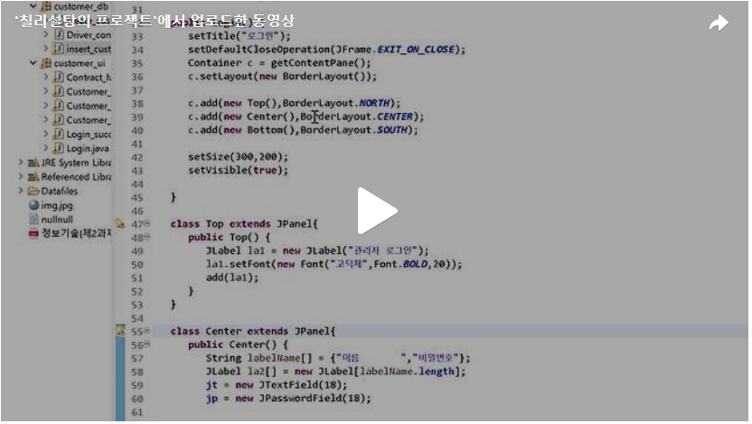

오늘은 Day6에 만든 GUI에서 한번 더 나아가 고객등록 버튼을 눌렀을때 조건에 맞추어 GUI가 나타나도록 만들어보겠습니다.<br>
만들어야 하는 GUI의 조건에 대하여 말씀드리겠습니다.<br>
● 보험계약 관리 화면 창에서 [고객 등록] 버튼을 클릭하면 [그림 2-6]과 같이 “고객 등록” 창이 열리도록 하시오.
● [그림 2-6]의 고객등록 창에 “고객코드”는 입력할 수 없도록 하시오.
● “생년월일”을 입력하고 엔터를 누를 경우 [그림 2-7]와 같이 고객코드를 생성하여 화면에 나타나도록 하시오. 고객코드는 “S”와 현재 년도 2자리와 생년월일의 합계를 조합한 형식이다.
예) 현재년도가 ‘2015’년이고 생년월일이 ‘1982-11-13’일 경우 고객코드는 ‘S’, ‘15’, (1982+11+13)를 조합한 ‘S152006’이 된다.
● 만약 필수항목(*)을 입력하지 않았을 경우 [그림 2-8]과 같이 메시지를 출력하고 저장되지 않도록 하시오.
● “고객명”, “생년월일”, “연락처”, “주소”, “회사” 항목을 입력하고 [추가] 버튼을 클릭하면 DB에 저장되도록 하시오. 만약 정상적으로 저장이 되면 [그림 2-9]와 같이 성공메시지를 출력하시오.
● [그림 2-6] 고객등록 창에서 [닫기] 버튼을 클릭하면 “고객 등록” 창이 닫히도록 하시오.<br>
<br>


[그림 2-6]에 보시는 것처럼 GUI의 틀을 만들어보겠습니다.<br>
우선 상단에 가로 2줄, 세로 6줄의 공간이 나오도록 GridLayout을 이용하여 Panel을 하나 생성해줍니다. 1행 부분에는 JLabel을 통한 label이 들어갈 것이고 2행 부분에는 각 부분에 대해 JTextField객체가 들어갈 것입니다. 그리고 조건을 보면 고객코드 부분은 비활성화를 하라고 명시되어있기에 setEnabled(false)를 이용하여 비활성화하는 코드를 사용하겠습니다.<br>
<br>
하단에는 "추가", "닫기" 버튼을 만들 Panel2를 생성해줍니다.<br>


이렇게 코드를 작성하고 실행을 시켜주면 아래와 같은 화면이 생성이 되는 것을 볼 수 있습니다.<br>

<br>
이제는 생년월일(YYYY_MM_DD)을 입력하는 JTextField부분에 입력을 한 후 키보드의 'Enter'를 눌렀을 때 비활성화된 고객코드 부분이 자동으로 고객코드를 생성하여 화면에 나타나도록 만들겠습니다.<br>
키보드의 'Enter'을 눌렀을때 고객코드가 생성되어 화면에 나타나야 하므로 KeyAdapter를 상속받은 클래스를 하나 생성합니다. 키보드의 버튼중 'Enter'가 눌려진 순간 Calendar클래스를 이용하여 현재연도를 얻은 후 조건에 맞게 고객코드를 만드는 코드를 작성합니다.<br>
단 입력한 생년월일 코드가 YYYY-MM-DD 이 형식이 아니라면 다시 입력을 하도록 하기 위해 생년월일의 JTextField를 split 함수를 이용해 '-' 단위로 나눈 후 split함수로 나누어진 부분이 3개가 나오지 않는다면 다시 입력하도록 만들었습니다.<br>

<br>
하단 Panel에 "추가", "닫기"에 대한 ActionListener를 생성해보겠습니다.<br>
만일 "추가"버튼을 눌렀을때 필수항목인(고객명, 생년월일, 연락처)가 한개라도 비어있으면 JOptionPane을 통해 다시 입력력하라는 메세지가 출력되도록 하고 필수항목을 다 채워넣고 "추가"를 누르면 Mysql의 customer 테이블에 입력한 정보가 저장이 되도록 하는 mathAdd()함수 실행되도록 합니다.<br>

<br>
mathAdd() 함수는 Mysql의 customer 테이블에 접속을 하고 직접 작성한 JTextField의 정보를 기반으로 customer 테이블에 정보를 추가를 하는 함수입니다. 만일 customer테이블에 존재하는 고객이름과 JTextField를 통해 작성한 고객이름이 중복이 되면 다른 고객이름을 입력하라는 JOptionPanel을 통해 메세지를 출력하도록 합니다.<br>

이제 Day1부터 현재까지 작성한 전체코드를 실행시켜보겠습니다.<br>

[](https://tv.kakao.com/v/445015295)<br>

```java
package customer_ui;

import java.awt.BorderLayout;
import java.awt.Container;
import java.awt.GridLayout;
import java.awt.event.ActionEvent;
import java.awt.event.ActionListener;
import java.awt.event.KeyAdapter;
import java.awt.event.KeyEvent;
import java.sql.Connection;
import java.sql.PreparedStatement;
import java.sql.ResultSet;
import java.sql.SQLException;
import java.util.Calendar;

import javax.swing.JButton;
import javax.swing.JFrame;
import javax.swing.JLabel;
import javax.swing.JOptionPane;
import javax.swing.JPanel;
import javax.swing.JTextField;
import customer_db.Driver_connect;

//고객등록 버튼을 눌렀을때 나오는 Gui
public class Customer_Sign_Up extends JFrame{
	JTextField [] jt;
	
	public Customer_Sign_Up(){
		setTitle("고객 등록");
		setDefaultCloseOperation(JFrame.EXIT_ON_CLOSE);
		Container c = getContentPane();;
		
		c.add(new Panel1(), BorderLayout.CENTER);
		c.add(new Panel2(), BorderLayout.SOUTH);
		
		setSize(500, 500);
		setVisible(true);
	}
	
	class Panel1 extends JPanel{
		public Panel1() {
			setLayout(new GridLayout(6,2));
			String [] name = {"고객 코드:", "*고객 명:", "*생년월일(YYYY_MM_DD):", "*연락처:", "주소:", "회사:"};
			jt = new JTextField[name.length];
			JLabel [] la = new JLabel[name.length];
			
			for(int i = 0 ; i< jt.length; i++) {
				la[i] = new JLabel(name[i]);
				jt[i] = new JTextField(15);
				add(la[i]); add(jt[i]);
			}
			//고객코드는 비활성화
			jt[0].setEnabled(false);
			
			//생년월일을 입력하고 Enter를 누르면 자동으로 고객코드가 생성되는 ActionListener
			jt[2].addKeyListener(new Action1());
		}
	}
	
	class Panel2 extends JPanel{
		public Panel2() {
			String s[] = {"추가","닫기"};
			JButton [] jb = new JButton[s.length];
			
			for(int i = 0; i<jb.length; i++) {
				jb[i] = new JButton(s[i]);
				add(jb[i]);	
				
				//추가 또는 닫기 버튼을 눌렀을때 입력 한 정보를 기반으로 고객이 추가되는 ActionListener
				jb[i].addActionListener(new Action2());
			}
		}
	}
	
	class Action2 implements ActionListener{
		@Override
		public void actionPerformed(ActionEvent e) {
			
			JButton btn = (JButton)e.getSource();
			if(btn.getText().equals("추가")) {
				if((jt[1].getText().equals("")|| jt[2].getText().equals("")||jt[3].getText().equals(""))) {
					JOptionPane.showMessageDialog(null, "필수항목(*)를 모두 입력해주세요","고객 등록 에러",JOptionPane.ERROR_MESSAGE);
					
				}else {
					//필수항목이 채워졌을 때 Mysql에 정보를 추가하는 메소드
					mathAdd();
				}
			}
			//닫기버튼을 누르면 화면 종료
			else {
				dispose();
			}
		}
	
		public void mathAdd() {
			boolean exist = false;
			Connection con = Driver_connect.makeConnection("customer");
			String sawoninsert = "insert into customer values (?, ?, ?, ?, ?, ?) ";
			PreparedStatement psmt = null;
			PreparedStatement psmt1 = null;
			String [] s = new String[jt.length];
			
			try {
				psmt = con.prepareStatement(sawoninsert);
				for(int i = 0; i<jt.length;i++) {
					s[i] = jt[i].getText();		
				}
				for(int k = 0; k<s.length;k++) {
					psmt.setString(k+1, s[k]);
				}
				//존재하는 고객일 경우 다른 이름으로 저장하도록 JoptionPane 생성(108~116)
				String checkName = "select * from customer where name like '"+s[1]+"'";
				psmt1 = con.prepareStatement(checkName);
				ResultSet rs = psmt1.executeQuery();
				
				if (rs.next()) {
	                exist = true;
	                JOptionPane.showMessageDialog(null, "존재하는 이름의 고객입니다. 다른이름을 입력해주세요.");
	                return;
	            }
				
				psmt.executeUpdate();
				JOptionPane.showMessageDialog(null, "고객추가가 완료되었습니다");
			} catch (SQLException e) {
				// TODO Auto-generated catch block
				e.printStackTrace();
			}
		}
		
	}

	class Action1 extends KeyAdapter{
		@Override
		public void keyPressed(KeyEvent e) {
			int keycode = e.getKeyCode();
			
			switch(keycode) {
			//Enter키를 눌렀을 때 고객코드==> S + (현재년도-2000) + 생년월일 합계 
			case KeyEvent.VK_ENTER:
				Calendar cal = Calendar.getInstance();
				int year = cal.get(Calendar.YEAR)-2000;
				String str[] = jt[2].getText().split("-");
				if(str.length!=3) {
					JOptionPane.showMessageDialog(null, "날짜 형식이 올바르지 않습니다. 다시 입력해주세요.", "오류", JOptionPane.ERROR_MESSAGE);
					return;
				}
				int hap = Integer.valueOf(str[0])+Integer.valueOf(str[1])+Integer.valueOf(str[2]);
				jt[0].setEnabled(true);
				jt[0].setText("S"+year+hap);
				jt[0].setEnabled(false);
			}
			
			super.keyPressed(e);
		}
	}
	


	public static void main(String[] args) {
		new Customer_Sign_Up();

	}

}

