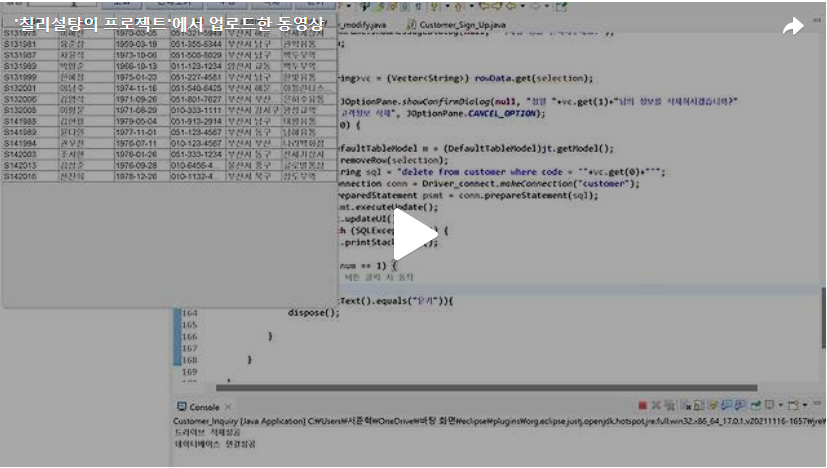

이제 고객조회 화면에 있는 "조회", "전체 보기", "수정", "삭제", "닫기" 버튼들에 대해 ActionListener를 만들어주는 과정을 진행하겠습니다.<br>
고객에 대한 정보는 Mysql에 customer테이블에 존재합니다. <br>


Day8에 만든 Gui화면을 이용하여 설명을 하겠습니다.<br>


우선 첫번째인 "조회"버튼에 대해 코드를 작성해보겠습니다.<br>
다들 아시는 것과 같이 성명옆에 존재하는 JTextField에 원하는 이름을 작성하고 조회를 하면 작성한 이름에 대한 정보가 출력이 되게 해야합니다. 그러기 위해서는 JTextField를 전역변수로 설정을 해주고 Mysql구문을 만들어주도록 하겠습니다.<br>


이 구문은 JTextField에 입력한 문자와 customer테이블 동일한 문자가 일치하는 항목을 검색하는 구문입니다.<br>
<br>
이후 "customer"테이블과 연결을 하고 Sql문을 실행하기 위한 Statement객체를 생성해주겠습니다.<br>
Sql문을 실행한 후 결과값을 ResultSet에 저장을 하고 ResultSet이 존재하지 않을때까지 for문을 이용하여 JTextField에 입력한 문자와 customer테이블 동일한 문자가 일치하는 항목테이블의 한행씩 읽어와 Vector에 저장하겠습니다.<br>
이 후 Vector에 저장된 결과값을 JTable에 나타나도록 하는 코드를 작성하겠습니다.<br>

<br>
여기서 코드를 보면 try-catch구문 안에 rowData.clear()이라는 코드가 있는것을 볼수 있습니다. 이 코드는 만일 전체보기를 눌렀다가 조회버튼을 누르면 전체보기에 대한 결과값 아래에 조회버튼에 대한 결과값이 붙어서 나오기 때문에 누를때마다 전에 사용한 버튼에 대한 결과값을 초기화 시키는 과정이라 보시면 되겠습니다. <br>
<br>
두번째인 "전체보기"버튼에 대해 코드를 작성해보겠습니다.<br>
"전체보기" 버튼은 "조회"버튼에 대해 이해를 하셨다면 매우 쉬울것 입니다.<br>
전체적인 틀은 같고 Sql구문만 아래와 같이 변경을 해주시면 됩니다.<br>

<br>
세번째인 "수정"버튼에 대해 코드를 작성해보겠습니다.<br>
문제에서 주어진 조건을 보겠습니다.<br>

<br>
int selection = jt.getSelectedRow(); 이라는 함수를 이용해 마우스를 이용해 JTable에 누른 행의 정보를 selection변수를 통해 받아옵니다. 이후 selection변수를 통해 받은 정보를 Vector에 저장을 합니다. 또한 "수정" 버튼을 눌렀을때 Gui가 생성되어야 하기에 Vector과 JTable을 매개변수로 하여 Gui가 생성되는 클래스를 하나 생성하도록 하겠습니다. <br>

<br>
저는 생성되는 클래서의 이름을 Customer_modify로 하였습니다. 또한 생성되는 Gui를 보시면 Day7에서 생성한 Gui와 같기때문에 Gui틀에 대해서는 설명을 생략하겠습니다. 혹시 Gui틀에 대해 다시 보고 싶다! 하시면 아래에 링크를 첨부하겠습니다.<br>
[블로그 바로가기](https://chilisugar-project.tistory.com/8)
<br>
<br>
조금 다른점이 있다면 고객코드와 고객명이 전부 비활성화 되야합니다.<br>
아래와 같이 매개변수를 통해 받은 Vector의 정보를 통해 JTextField를 채우고 고객코드와 고객명이 비활성화되는 코드입니다.<br>

<br>

이제 이름과 고객코드를 제외한 나머지 JTextField부분에 수정해야 할 부분이 있으면 수정을 완료하고 "수정" 버튼을 눌렀거나 수정할 부분이 없어 "닫기" 버튼을 눌렀을때  ActionListenr를 걸어주도록 하겠습니다.<br>

여기서 i = 2부터 시작인데 고객코드와 고객명은 바뀌면 안되기에 2부터 시작을 했고 v.set() 함수를 이용하여 매개변수로 받은 Vector에서 수정된 부분을 다시 Vector에 저장하는 코드입니다. 이후  JTable을 업데이트하여 수정된 정보가 보이도록 코드를 만들었습니다.<br>

<br>
이렇게 하면 수정이 끝난것 같지만 아닙니다. 왜냐하면 수정된 부분을 Mysql에도 수정을 해줘야하기 때문이죠!<br>
이제 Mysql에 수정하는 코드를 짜보도록 하겠습니다.<br>
Sql문을 실해시키기 위한 PreparedStatement 객체를 생성하겠습니다. <br>
Mysql에서 수정을 하는 Sql구문을 작성해보도록 하겠습니다.<br>
<br>


<br>
이 Sql구문은 "customer"테이블에서 code와 name이 일치하는 정보의 birth, tel, address, company를 업데이트 하는 구문입니다. 이후 PreparedStatement객체를 이용하여 Sql구문을 실행시켜주겠습니다.<br>
이후 Sql구문에 들어있는 ?에 해당하는 값을 넣어주기 위한 코드를 작성해주겠습니다. ?에 해당하는 값을 다 넣어줬다면 Sql문을 데이터베이스에 보내는 psmt.executeUpdate()를 사용합니다.<br>

<br>
이렇게 하면 수정에 대한 부분도 완성했습니다.<br>
이제 "삭제" 버튼에 대한 코드를 작성해보겠습니다.<br>
"삭제" 버튼도 "수정"버튼과 같이 삭제할 행을 누르고 그 행에 대한 정보를 Vector에 저장을 해주도록 하겠습니다.<br>
하지만 만일 선택된 행이 없을때 삭제할 행을 선택하라는 JOptionPane을 만들어주도록 하겠습니다.<br>
<br>
이후 행이 선택됬다면 그 선택된 행의 고객명을 Vector에서 가져와 JOptionPanel의 showConfirmDialog를 이용하여 정말 삭제할것인지 물어보고 "확인"버튼을 누르면 아래와 같은 코드를 작성해 JTable에서 삭제 시키겠습니다. <br>

이제 Mysql에서 데이터를 삭제시키기 위한 Sql문을 작성하도록 하겠습니다.<br>


<br>
Vector의 0번째 index의 정보를 customer테이블의 code와 비교하여 일치하면 삭제하는 Sql문입니다.<br>
이후 Sql문을 실행시키기 위한 PreparedStatement객체를 생성해주고 Sql문을 생성합니다. 이후 psmt.executeUpdate(); 코드를 사용해 Sql문을 실행시키고 jt.updateUI(); 코드를 사용하여 JTable을 업데이트 합니다.<br>
드디어 마지막! "닫기" 버튼에 대한 코드를 작성하겠습니다.<br>
정말 간단합니다. dispose()함수를 이용하면 화면을 지웁니다.


<br>
이렇게 전부 완성했습니다. 결과에 대한 동영상을 한번 보시겠습니다!!

[](https://tv.kakao.com/v/445323573)<br>

아래는 전체 코드입니다 <br>
```java
package customer_ui;

import java.awt.BorderLayout;
import java.awt.event.ActionEvent;
import java.awt.event.ActionListener;
import java.sql.Connection;
import java.sql.PreparedStatement;
import java.sql.ResultSet;
import java.sql.SQLException;
import java.sql.Statement;
import java.util.Vector;

import javax.swing.JButton;
import javax.swing.JFrame;
import javax.swing.JLabel;
import javax.swing.JOptionPane;
import javax.swing.JPanel;
import javax.swing.JScrollPane;
import javax.swing.JTable;
import javax.swing.JTextField;
import javax.swing.table.DefaultTableModel;

import customer_db.Driver_connect;

public class Customer_Inquiry extends JFrame{
	Vector rowData;
	JTable jt;
	JTextField jt1;
	String JTable_Name[] ={"code", "name", "birth", "tel","address","company"};
	
	
	public Customer_Inquiry() {
		setTitle("고객조회");
		setDefaultCloseOperation(JFrame.EXIT_ON_CLOSE);
		
		rowData = new Vector<String>();
		Vector<String> colData = new Vector<String>();
		
		//JTable_Name의 길이만큼 행추가
		for(int i = 0; i<JTable_Name.length;i++) {
			colData.add(JTable_Name[i]);
			
		}
		jt = new JTable(rowData,colData);
		JScrollPane jps = new JScrollPane(jt);
		add(jps,BorderLayout.CENTER);
		add(new Top(),BorderLayout.NORTH);
		
		setSize(500,500);
		setVisible(true);
		
	}
	class Top extends JPanel{
		public Top() {
			JLabel la = new JLabel("성명");
			jt1 = new JTextField(10);
			add(la); add(jt1);
			
			String s[] = {"조회", "전체보기", "수정", "삭제","닫기"};
			JButton []jb = new JButton[s.length];
			for(int i = 0; i<jb.length; i++) {
				jb[i] = new JButton(s[i]);
				add(jb[i]);
				//조회, 전체보기, 수정, 삭제, 닫기 버튼에 대한 ActionListener
				jb[i].addActionListener(new Action());
			}	
		}
	}
	
	class Action implements ActionListener{
		@Override
		public void actionPerformed(ActionEvent e) {
			JButton b = (JButton)e.getSource();
			//누른 버튼이 조회버튼일 경우
			if(b.getText().equals("조회")) {
				String sql = "select * from customer where name like '%"+jt1.getText()+"%'";
				
				try {
					rowData.clear();
					Connection conn = Driver_connect.makeConnection("customer");
					Statement stmt = conn.createStatement();
					ResultSet rs = stmt.executeQuery(sql);
					
					while(rs.next()) {
						Vector<String> v = new Vector<String>();
						for(int i = 0; i<JTable_Name.length; i++) {
							v.add(rs.getString(i+1));
						}
						rowData.add(v);
					}
					jt.updateUI();
					conn.close();
				} catch (SQLException e1) {
					// TODO Auto-generated catch block
					e1.printStackTrace();
				}
				
			}
			//누른 버튼이 전체보기버튼일 경우
			else if(b.getText().equals("전체보기")) {
				jt.clearSelection();
				String sql = "select * from customer";
		
				try {
					rowData.clear();
					Connection conn = Driver_connect.makeConnection("customer");
					Statement stmt = conn.createStatement();
					ResultSet rs = stmt.executeQuery(sql);
					
					while(rs.next()) {
						Vector<String> v = new Vector<String>();
						for(int i = 0; i<JTable_Name.length; i++) {
							v.add(rs.getString(i+1));
						}
						rowData.add(v);
					}
					//최신 ui버전으로 업데이트
					jt.updateUI();
					conn.close();
					
				} catch (SQLException e1) {
					// TODO Auto-generated catch block
					e1.printStackTrace();
				}
			}
			//누른 버튼이 수정버튼일 경우
			else if(b.getText().equals("수정")) {
				//누른 열에 대하여 그 정보를 vector에 저장을 하고 저장된 vector을 Customer_modify의 매개변수로 설정한 후 Customer_modify클래스로 이동
				int selection = jt.getSelectedRow();
				Vector<String>vc = (Vector<String>) rowData.get(selection);
				
				new Customer_modify(vc,jt);
				
			}
			//누른 버튼이 삭제버튼일 경우
			else if(b.getText().equals("삭제")) {
			    int selection = jt.getSelectedRow();
			    // 선택한 행이 없는 경우 메시지를 표시
			    if(selection == -1) {
			        JOptionPane.showMessageDialog(null, "삭제할 행을 선택해주세요.");
			        return;
			    }
			    
			    Vector<String>vc = (Vector<String>) rowData.get(selection);
			    
			    int num = JOptionPane.showConfirmDialog(null, "정말 "+vc.get(1)+"님의 정보를 삭제하시겠습니까?"
			    		,"고객정보 삭제", JOptionPane.CANCEL_OPTION);
			    if(num == 0) {
			        try {
			            DefaultTableModel m = (DefaultTableModel)jt.getModel();
			            m.removeRow(selection);
			            String sql = "delete from customer where code = '"+vc.get(0)+"'";
			            Connection conn = Driver_connect.makeConnection("customer");
			            PreparedStatement psmt = conn.prepareStatement(sql);
			            psmt.executeUpdate();
			            jt.updateUI();
			        } catch (SQLException e1) {
			            e1.printStackTrace();
			        }
			    } else if(num == 1) {
			        // 취소 버튼 클릭 시 동작
			    }
			}else if(b.getText().equals("닫기")){
				dispose();
				
			}
			
		}
	
	}
	
	
	
	public static void main(String[] args) {
		new Customer_Inquiry();

	}


}
```

<br>아래는 "수정"버튼을 눌렀을때 생성되는 Gui에 대한 코드입니다.<br>

```java
package customer_ui;

import java.awt.BorderLayout;
import java.awt.Container;
import java.awt.GridLayout;
import java.awt.event.ActionEvent;
import java.awt.event.ActionListener;
import java.sql.Connection;
import java.sql.PreparedStatement;
import java.sql.SQLException;
import java.util.Vector;

import javax.swing.JButton;
import javax.swing.JFrame;
import javax.swing.JLabel;
import javax.swing.JPanel;
import javax.swing.JTable;
import javax.swing.JTextField;
import customer_db.Driver_connect;


public class Customer_modify extends JFrame{
	Vector v;
	JTextField [] jt1;
	JTable jt;
	
	public Customer_modify(Vector v, JTable jt){
		this.v =v;
		this.jt = jt;
		setTitle("고객 등록");
		setDefaultCloseOperation(JFrame.EXIT_ON_CLOSE);
		Container c = getContentPane();;
		
		c.add(new Panel1(), BorderLayout.CENTER);
		c.add(new Panel2(), BorderLayout.SOUTH);
		
		setSize(500, 500);
		setVisible(true);
	}
	
	class Panel1 extends JPanel{
		public Panel1() {
			setLayout(new GridLayout(6,2));
			String [] name = {"고객 코드:", "*고객 명:", "*생년월일(YYYY_MM_DD):", "*연락처:", "주소:", "회사:"};
			jt1 = new JTextField[name.length];
			JLabel [] la = new JLabel[name.length];
			
			
			for(int i = 0 ; i< jt1.length; i++) {
				la[i] = new JLabel(name[i]);
				jt1[i] = new JTextField(15);
				add(la[i]); add(jt1[i]);
			}
			jt1[0].setText((String) v.get(0));
			jt1[0].setEnabled(false);
			jt1[1].setText((String) v.get(1));
			jt1[1].setEnabled(false);
			for(int i = 2; i<jt1.length; i++) {
				jt1[i].setText((String) v.get(i));
			}
			
		}
		
	}
	
	class Panel2 extends JPanel{
		public Panel2() {
			String s[] = {"수정","닫기"};
			JButton [] jb = new JButton[s.length];
			
			for(int i = 0; i<jb.length; i++) {
				jb[i] = new JButton(s[i]);
				add(jb[i]);
				jb[i].addActionListener(new Action());
			}
			
			
		}
	}
	
	class Action implements ActionListener{
		@Override
		public void actionPerformed(ActionEvent e) {
			JButton jb = (JButton)e.getSource();
			if(jb.getText().equals("수정")) {
				for(int i = 2; i<jt1.length; i++) {
					v.set(i, jt1[i].getText());
					//최신 ui버전으로 업데이트
					jt.updateUI();
					}
					
				}else {
					dispose();
				}
					try {
						PreparedStatement psmt = null;
						Connection conn = Driver_connect.makeConnection("customer");
						String sql = "update customer set birth = ?, tel = ?, address = ?, "
								+ "company = ? where code = ? and name = ?";
						psmt =conn.prepareStatement(sql);

						psmt.setString(1, (String) v.get(2));
						psmt.setString(2, (String) v.get(3));
						psmt.setString(3, (String) v.get(4));
						psmt.setString(4, (String) v.get(5));
						psmt.setString(5, (String) v.get(0));
						psmt.setString(6, (String) v.get(1));
						psmt.executeUpdate();
					} catch (SQLException e1) {
						// TODO Auto-generated catch block
						e1.printStackTrace();
					}
			
			}
			
		}
	
//	public static void main(String[] args) {
//	      new Customer_modify(null, null);
//
//	   }

}
	


